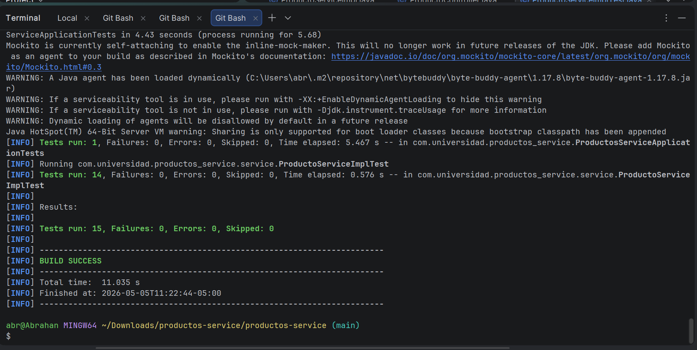

# productos-service — Post-Contenido 1, Unidad 9

## Pruebas Unitarias y de Integración con JUnit 5 y Mockito


## Descripción del Proyecto

Microservicio de gestión de productos desarrollado con Spring Boot 3.3.x que implementa una suite completa de pruebas unitarias con JUnit 5 y Mockito. El proyecto aplica `@Mock` e `@InjectMocks` para aislar la lógica de negocio de sus dependencias, verifica comportamientos con assertions específicas, y cubre escenarios de error con pruebas parametrizadas y captura de argumentos mediante `ArgumentCaptor`.

---

## Tecnologías utilizadas

| Tecnología | Versión |
|-----------|---------|
| Java | 21 |
| Spring Boot | 3.3.x |
| Spring Data JPA | Incluido en Spring Boot |
| H2 Database | Incluido en Spring Boot |
| Lombok | Incluido en Spring Boot |
| JUnit 5 | Incluido en Spring Boot Starter Test |
| Mockito | Incluido en Spring Boot Starter Test |
| Maven | 3.9+ |

---

## Estructura del Proyecto

```
src/
├── main/
│   └── java/com/universidad/productosservice/
│       ├── ProductosServiceApplication.java
│       ├── domain/
│       │   └── Producto.java               ← Entidad JPA
│       ├── repository/
│       │   └── ProductoRepository.java     ← JpaRepository
│       ├── service/
│       │   ├── ProductoService.java        ← Interfaz
│       │   └── ProductoServiceImpl.java    ← Implementación con validaciones
│       └── controller/
│           └── ProductoController.java     ← REST Controller
└── test/
    └── java/com/universidad/productosservice/
        └── service/
            └── ProductoServiceImplTest.java ← Suite de pruebas (14 tests)
```

---

## Instrucciones de Ejecución

### 1. Clonar el repositorio

```bash
git clone https://github.com/Abrahan07/Patrones-Remolina-post1-u9.git
cd Patrones-Remolina-post1-u9
```

### 2. Compilar el proyecto

```bash
mvn compile
```

### 3. Ejecutar las pruebas

```bash
mvn test
```

---

## Cobertura de Pruebas

La suite cubre escenarios positivos, negativos y de borde del servicio `ProductoServiceImpl`:

| Escenario | Método de prueba | Tipo |
|-----------|-----------------|------|
| Crear producto con datos válidos | `crear_datosValidos_retornaProductoGuardado` | Happy path |
| Buscar producto existente por ID | `buscarPorId_existente_retornaProducto` | Happy path |
| Buscar producto inexistente | `buscarPorId_noExistente_lanzaRuntimeException` | Error |
| Nombre inválido (null, vacío, espacios) | `crear_nombreInvalido_lanzaIllegalArgumentException` | Parametrizado (5 casos) |
| Precio inválido (cero o negativo) | `crear_precioInvalido_lanzaIllegalArgumentException` | Parametrizado (4 casos) |
| Nombre con espacios se normaliza | `crear_nombreConEspacios_guardaNombreNormalizado` | ArgumentCaptor |
| Eliminar producto existente | `eliminar_productoExistente_llamaDeleteById` | Verificación avanzada |

**Total: 15 tests ejecutados — 0 fallos — 0 errores**

---

## Evidencia de Pruebas en Verde



---
